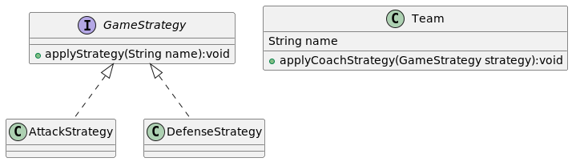
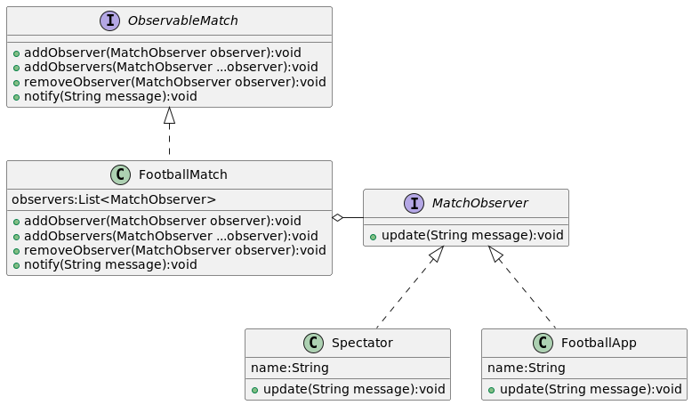
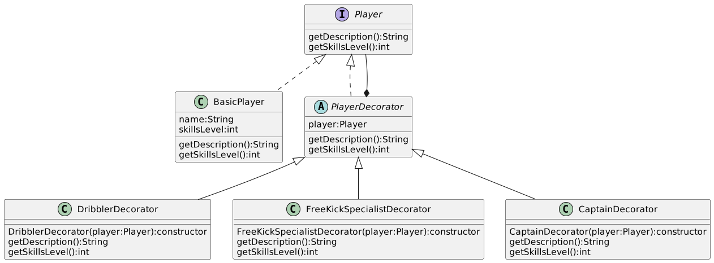
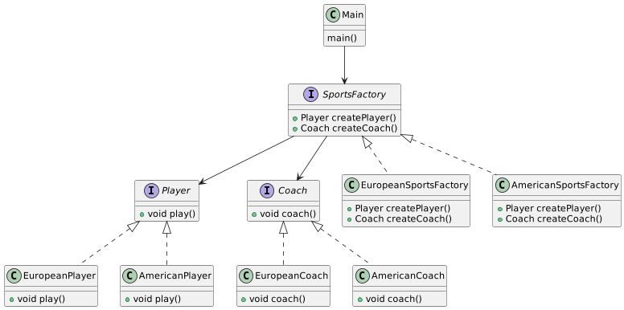
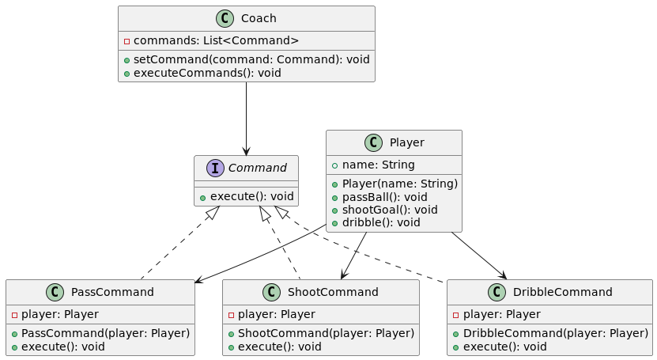

# Presentation

Football-Patterns is a Java project showcasing how design patterns are applied in football. It offers practical examples of classic patterns using scenarios from the football world.

# Strategy Pattern

The Strategy design pattern is like a toolbox for solving different problems in similar ways but with different approaches. in the context of football is like having different game strategies for different match situations. Imagine a football team with various game plans, such as attacking aggressively or defending cautiously.

In the Strategy design pattern, each game plan is represented by a strategy. You can choose the strategy that best suits the current match scenario. For instance, if your team is leading and wants to maintain possession of the ball, you might choose a defensive strategy. On the other hand, if your team is trailing and needs to score quickly, you might opt for an aggressive attacking strategy.

Similarly, in our football example, the Strategy design pattern involves defining multiple possible strategies for playing the game. Each strategy is encapsulated in a separate class, such as AttackStrategy and DefenseStrategy. This allows the team to switch strategies dynamically during the game based on the current situation on the field.

In summary, the Strategy design pattern allows football teams to dynamically choose from several predefined game strategies based on the current match circumstances. This flexibility enhances the team's ability to respond effectively to different game situations, ultimately improving their chances of success on the field.

# Observer Pattern
The Observer pattern is a design pattern that allows an object, called the subject or observable, to maintain a list of its dependents, called observers, and notify them automatically of any state changes, typically by calling a specific method on each observer when the subject's state changes.

Think of it this way: imagine you follow several friends on a social media platform. Whenever one of your friends posts a new update, you automatically receive a notification without your friend having to inform you individually about each post.

In this scenario:

- Your friend on the social media platform is the subject or observable.
- You and other users who follow your friend are the observers.

Every time your friend posts a new update (i.e., the subject's state changes), you and other users who follow your friend automatically receive a notification of the new update without your friend having to individually contact each follower.

# Application in the Example of Football Match Tracking:

Now let's apply this concept to our example of tracking a football match:

- The football match is the subject or observable.
- The spectators using the match tracking application are the observers.

Each time an event occurs during the match, such as a goal scored, a card shown, or a player substitution, the match automatically sends a notification to all spectators of the application, without needing to individually contact each spectator. Each spectator then reacts accordingly, for example, by displaying the information on the screen or sending push notifications.

By using the Observer pattern, our football match tracking application can easily update all its spectators in real-time on the match events, providing an immersive and engaging experience for football fans.

# Decorator Pattern

The Decorator Design Pattern is a structural design pattern that allows for dynamically adding additional responsibilities to an object without altering its structure. Decorators provide a flexible alternative to subclassing for extending an object's functionalities.

**Key Characteristics of the Decorator Pattern :** 
- **Flexibility** : Allows adding functionalities to individual objects dynamically.
- **Transparency** : Decorated objects can be used in the same way as undecorated objects, as they share the same interface or base class.
- **Combination of Behaviors** : Multiple decorators can be combined to add various functionalities to an object.

**Structure of the Decorator Pattern**

- **Component** : An interface or abstract class defining the operations that objects can perform.
- **ConcreteComponent** : A concrete implementation of the Component interface that represents the core object to which additional responsibilities can be added.
- **Decorator** : An abstract class implementing the Component interface and containing a reference to a Component object. It delegates operations to the referenced object.
- **ConcreteDecorator** : Concrete classes extending the Decorator class and adding specific functionalities to the decorated object.

In the domain of football, the Decorator pattern can be used to dynamically add skills or additional characteristics to players without modifying the base player class. For instance, we can add skills such as Dribbler,Free Kick Specialist, or Captain to specific players.

# Factory Pattern

The Abstract Factory Pattern is a design pattern that provides an interface for creating families of related or dependent objects without specifying their concrete classes. This pattern allows you to group objects that belong to the same family and use them together, ensuring consistency and interchangeability of the created objects.

The main objectives of the Abstract Factory Pattern are to encapsulate object creation to prevent client code from knowing concrete classes, facilitate extensibility by allowing the addition of new product families without modifying existing code, and ensure consistency among objects created by the same factory.

The pattern consists of several key components:

- **Abstract Factory** : An interface or abstract class that declares the creation methods for each type of product.
- **Concrete Factory**: Concrete implementations of the abstract factory that create specific instances of products.
- **Abstract Product**: Interfaces or abstract classes for the different types of products that can be created.
- **Concrete Product**: Concrete implementations of the abstract products.
- **Client**: The code that uses the abstract factory to create objects without knowing their concrete classes.

Example Implementing the Abstract Factory Pattern: 

In our project, we have two types of products: players and coaches. Each of these products can have different implementations depending on the league to which they belong.

- Define Product Interfaces: We start by defining interfaces for players and coaches. These interfaces declare the methods that each type of product must implement, without specifying details on how these methods will be implemented.
- Create Concrete Products: Next, we create concrete classes for each type of player and coach. For example, a European player might play differently than an American player, and the same goes for coaches.
- Define the Abstract Factory: We define an interface for the abstract factory that declares methods for creating objects of each product type. This interface allows the client to create products without knowing the details of their implementation.
- Implement Concrete Factories: We create concrete classes that implement the abstract factory interface. Each concrete factory is responsible for creating specific objects for a given league. For example, a factory for the European League will create European players and coaches.
  

# Command Pattern

The Command Pattern is a behavioral design pattern that turns a request into a stand-alone object that contains all information about the request. This transformation allows for parameterizing clients with queues, requests, and operations. The primary objective of the Command Pattern is to decouple the object that invokes the operation from the object that knows how to perform it.

Key Components of the Command Pattern
- Command Interface: Declares an interface for executing an operation.
- Concrete Command: Implements the Command interface and defines the binding between a receiver and an action.
- Receiver: Knows how to perform the work needed to carry out the request.
- Invoker: Asks the command to carry out the request.
- Client: Creates a ConcreteCommand object and sets its receiver.

## Example 

Imagine we are developing a football simulation application. We want to encapsulate different actions that players can perform on the field, such as passing the ball, shooting at the goal, and dribbling . We can use the Command Pattern to model these actions.

- Command Interface:
  - Defines the execute method which every command will implement.
- Concrete Commands:
  - PassCommand: Represents the action of passing the ball.
  - ShootCommand: Represents the action of shooting at the goal.
  - DribbleCommand: Represents the action of dribbling .
- Receiver:

  - Player: Knows how to perform actions like passing, shooting, and dribbling.
- Invoker:

  - Coach: Stores and invokes commands.
- Client:

  - Sets up the commands and associates them with the player actions.

  
How it Works
- Player (Receiver): This is the class that will perform the actual work. For instance, the player can pass the ball, shoot, or dribble.
- Command Interface: An interface that declares the execute method. All command classes will implement this interface.
- Concrete Commands: Each action the player can take is represented by a concrete command class. For example, PassCommand, ShootCommand, and DribbleCommand each implement the Command interface and define the execute method to call the appropriate method on the player.
- Coach (Invoker): The coach can issue commands to players. It keeps track of commands and can execute them as needed.
- Client: The client sets up the commands, assigns them to the players, and uses the coach to execute these commands.

  
