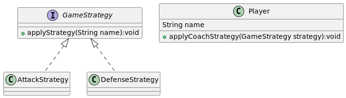

# Presentation

Football-Patterns is a Java project showcasing how design patterns are applied in football. It offers practical examples of classic patterns using scenarios from the football world.

# Strategy Pattern

The Strategy design pattern is like a toolbox for solving different problems in similar ways but with different approaches. in the context of football is like having different game strategies for different match situations. Imagine a football team with various game plans, such as attacking aggressively or defending cautiously.

In the Strategy design pattern, each game plan is represented by a strategy. You can choose the strategy that best suits the current match scenario. For instance, if your team is leading and wants to maintain possession of the ball, you might choose a defensive strategy. On the other hand, if your team is trailing and needs to score quickly, you might opt for an aggressive attacking strategy.

Similarly, in our football example, the Strategy design pattern involves defining multiple possible strategies for playing the game. Each strategy is encapsulated in a separate class, such as AttackStrategy and DefenseStrategy. This allows the team to switch strategies dynamically during the game based on the current situation on the field.

In summary, the Strategy design pattern allows football teams to dynamically choose from several predefined game strategies based on the current match circumstances. This flexibility enhances the team's ability to respond effectively to different game situations, ultimately improving their chances of success on the field.

